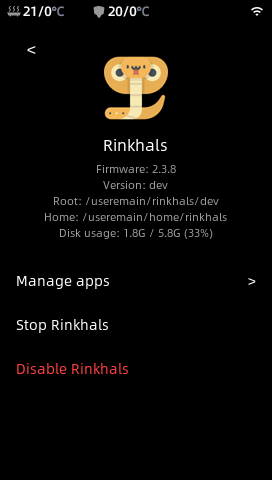
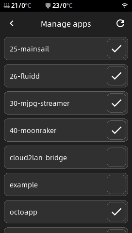
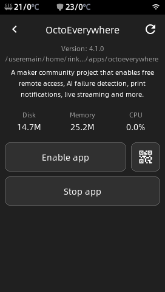

# Rinkhals

Rinkhals is a custom firmware for some Anycubic Kobra 3D printers (specifically the ones running Kobra OS, see below for the details).

The goal of this project is to expand existing Anycubic features with better compatibility, apps and more.
I will likely not support all use cases, like running vanilla Klipper or your specific feature / plugin.

By using Rinkhals, you will keep all stock Anycubic features (print screen, Anycubic tools, calibration, ...) and get even more, like:
- Mainsail, Fluidd (with Moonraker)
- USB camera support in Mainsail, Fluidd
- Prints from Orca will show the print screen
- SSH access for customization (user: **root**, password: **rockchip**)
- [Apps system](https://github.com/jbatonnet/Rinkhals.apps) (OctoApp, Cloudflare, Tailscale, ...)

For now the following printers and firmwares are tested / supported:
| Model  | Tested firmwares | Notes |
| -- | -- | -- |
| Kobra 3 (+ combo) | `2.3.5.3` `2.3.8` | `2.3.7` and `2.3.7.1` have some instabilities |
| Kobra 2 Pro | `3.1.2.3` | Only with mainboard [Trigorilla Spe **B** v1.0.x](https://1coderookie.github.io/Kobra2ProInsights/hardware/mainboard/#trigorilla_spe_b_v10x-stock-new-revision). `3.1.4` is buggy |
| Kobra S1 (+ combo) | `2.4.8.3` `2.5.0.2` `2.5.0.6` |

In case you're wondering this project is named after rinkhals, a sub-species of Cobras ... Kobra ... Rinkhals 👏

You can join the Rinkhals community on Discord: https://discord.gg/3mrANjpNJC

Since people have been asking, I accept donations but please remember that I work on Rinkhals for fun and not for the money. I will not accept donations to work on specific bugs or features.

    

## How to install Rinkhals

> [!WARNING]
> **Make sure you're confident tweaking your printer and you understand what you're doing. I'm not responsible if you brick your printer (even if there's some [documentation](https://github.com/jbatonnet/Rinkhals/wiki/Boot-issues) about that)**

> [!CAUTION]
> Many users want to change their Klipper printer configuration (the printer.cfg file). I strongly advise not modifying the stock printer configuration. Rinkhals offers additional protection you don't have while modifying directly your printer configuration. **I won't offer any support** and **your printer might not work properly or not boot anymore**. Check the Wiki for more information: [Printer configuration](https://github.com/jbatonnet/Rinkhals/wiki/Rinkhals-%E2%80%90-Printer-configuration)

Rinkhals uses an overlay system to keep its modifications isolated from the stock firmware. This way it's easier to revert back to stock if needed, or use multiple versions in parrallel.

Download the release you want from the [Releases](https://github.com/jbatonnet/Rinkhals/releases) page, rename it as **update.swu** in a directory named **aGVscF9zb3Nf** on a FAT32 USB drive.

For more information about installation, firmware updates and details about specific situations, go to https://github.com/jbatonnet/Rinkhals/wiki/Rinkhals-%E2%80%90-Installation-and-firmware-updates

## Touch UI

After installation, Rinkhals provides a touch UI accessible from the printer screen when you tap the Settings icon, then tap Rinkhals.

This UI allows you to stop or disable Rinkhals, and to control what feature and or app is enabled. This will allow you to customize your experience and keep the printer memory as low as needed based on your needs.

    <!--  -->
    
    
    

## Apps system

An apps system is provided in Rinkhals. It allows for the users to easily add some features to their printer. Some default ones are provided and other are available on separate repos like:
- https://github.com/jbatonnet/Rinkhals.apps (Tailscale, Cloudflare, OctoApp companion, some progress on vanilla Klipper, ...)
- https://github.com/basvd/Rinkhals.WebUI (a web interface for Rinkhals)

Instructions on how to install or develop apps are on the other repo as well.

## How to uninstall Rinkhals

1. **Disable Rinkhals** by disabling from the touch UI or by creating a .disable-rinkhals file on a USB drive or at this location: /useremain/rinkhals/.disable-rinkhals
2. **Reboot your printer**, it will boot the stock firmware
3. If you want, you can **delete Rinkhals** by deleting the /useremain/rinkhals directory

    

## Documentation / Known issues

The [wiki](https://github.com/jbatonnet/Rinkhals/wiki) is a collection of documentation, reverse engineering and notes about the printer and development, don't forget to [check it out](https://github.com/jbatonnet/Rinkhals/wiki)!

If your printer shows a 11407 error, check the wiki there: [See the wiki about error 11407](https://github.com/jbatonnet/Rinkhals/wiki/Firmware#my-printer-shows-a-11407-error)

## SWU tools

This repo contains some tools you can use **no matter what firmware you are using**. It is a set of scripts packaged in a SWU file.

They are available on this page: https://github.com/jbatonnet/Rinkhals/actions/workflows/build-swu-tools.yml

You can download the SWU file for the tool you want, copy it on a FAT32 USB drive in a **aGVscF9zb3Nf** directory, plug the USB drive in the Kobra and it just works.
You will ear two beeps, the second one will tell you that the tool completed its work. There is no need to reboot afterwards.

Here are the tools available:
- **SSH**: get a SSH server running on port **2222**, even on stock firmware
- **Backup partitions**: creates a dump of your userdata and useremain partition on the USB drive
- **Debug bundle**: creates a zip file with printer and configuration information on the USB drive to ease debugging

    

## Development

> [!WARNING]
> If you develop on Windows like me, don't forget to disable Git's autocrlf function, as this repo contains Linux scripts running on Linux machines. 
> Run `git config core.autocrlf false` **BEFORE** cloning the repo

You will need either a Linux machine or a Windows machine with Docker.

Here are the steps: 
- Clone the repo or Download the zip
- Do your modifications
- Open a terminal at the root of the repo, and run: `docker run --rm -it -e KOBRA_IP=x.x.x.x -v .\build:/build -v .\files:/files --entrypoint=/bin/sh rclone/rclone:1.68.2 /build/deploy-dev.sh`

This will create a "dev" version on your printer. Using the script above will synchronize your workspace with your PC.
Now you can start/restart your updated "dev" version using SSH:
- `chmod +x /useremain/rinkhals/dev/start.sh`
- `/useremain/rinkhals/dev/start.sh`

If you ever want to create a full SWU with your version, use the `build-swu.sh` script with Docker, and you'll get your SWU in build/dist/update.swu:
  `docker run --rm -it -e VERSION="yyyymmdd_nn" -v .\build:/build -v .\files:/files ghcr.io/jbatonnet/rinkhals/build /build/build-swu.sh`

If you're ever stuck, reboot, use the SSH SWU tool to regain SSH if you lost it, or reflash the last version if things don't work.

## Thanks

Thanks to the following projects/persons:
- utkabobr (https://github.com/utkabobr/DuckPro-Kobra3)
- systemik (https://github.com/systemik/Kobra3-Firmware)
- Anycubic for the cool printer and the few OSS items (https://github.com/ANYCUBIC-3D/Kobra)
- Icon created by Freepik - Flaticon (https://www.flaticon.com/free-icon/cobra_375098)
- moosbewohner for Kobra 2 Pro support (https://github.com/moosbewohner/Rinkhals)
- Kalenell and woswai1337 for Kobra S1 support

Thanks to the project and apps contributors, including the persons below and many more:
- Matthias Goebl (https://github.com/matgoebl)
- Tobias Göbel (https://github.com/kubax)
- dan3805 (https://github.com/dan3805)
- basvd (https://github.com/basvd)
- Meowcat285 (https://github.com/Meowcat285)
