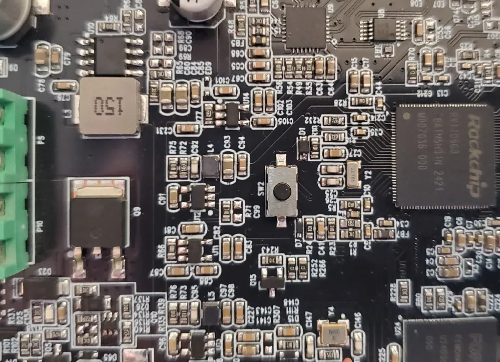
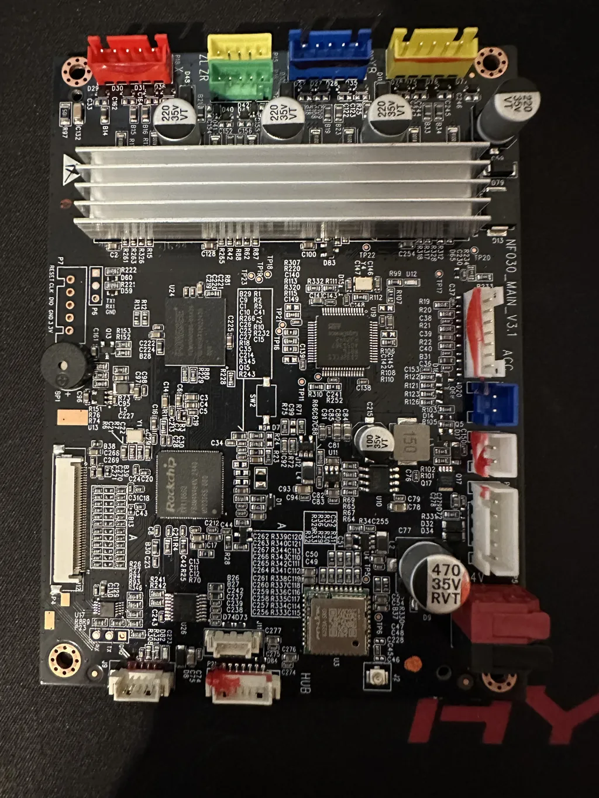
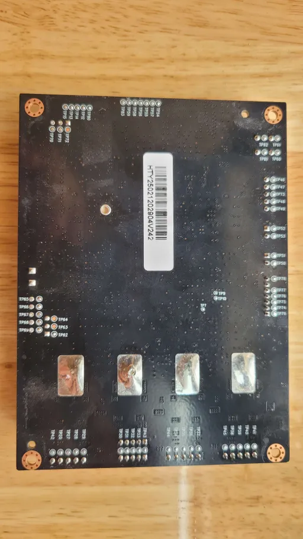
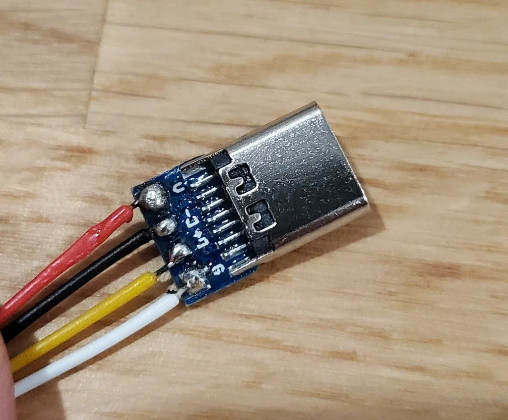
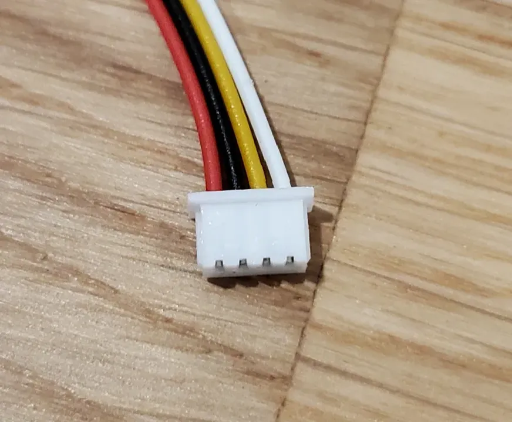
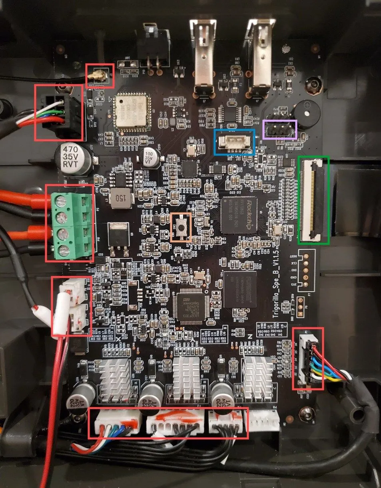

!!! abstract "References"

    - Firmware flashing: [https://github.com/Bushmills/Anycubic-Kobra-3-rooted/discussions/5#discussion-7091124](https://github.com/Bushmills/Anycubic-Kobra-3-rooted/discussions/5#discussion-7091124)
    - Cable build: [https://github.com/Bushmills/Anycubic-Kobra-3-rooted/discussions/5#discussioncomment-10443776](https://github.com/Bushmills/Anycubic-Kobra-3-rooted/discussions/5#discussioncomment-10443776)
    - Partition modification: [https://github.com/Bushmills/Anycubic-Kobra-3-rooted/discussions/5#discussioncomment-11320579](https://github.com/Bushmills/Anycubic-Kobra-3-rooted/discussions/5#discussioncomment-11320579)

The different printers in the Kobra series have different mainboards.
Kobra 3, Kobra 3 Max and Kobra S1 ones are different but use a very similar structure.

Here is a step by step guide on how to do it with a Kobra 3 mainboard without the SW2 switch:
[Kobra 3 mainboard with missing SW2](kobra-3-mainboard-with-missing-sw2.md)

## Mainboard information

??? info "Kobra 3 Mainboard"

    <div class="grid cards" markdown>

    - { width="300" }
    Mainboard for the Kobra 3 (early unit)
    - 
    Cropped image of SW2 and surrounding components (early unit)
    - 
    Cropped image of SW2 and surrounding components (late unit with missing SW2)

    </div>

??? info "Kobra 3 Max Mainboard"

    <div class="grid cards" markdown>

    - 
    Front side of a Kobra 3 Max mainboard
    - 
    Back side of a Kobra 3 Max mainboard

    [Kobra 3 Max investigation](kobra-3-max-investigation.md)

    </div>

??? info "Kobra S1 Mainboard"

    **TODO**

## Building the cable

The motherboard has USB firmware access using a JST MX / Molex PicoBlade 1.25mm pitch connector. You will need to build a cable to make it usable using a classic USB-A or USB-C connector.

If you want to use a USB-C female connector, you will need to use a USB-A to USB-C cable to connect to your computer. USB-C to USB-C might not work properly.

- Get a JST MX / Molex PicoBlade 1.25mm pitch connector
    - [https://www.amazon.com/dp/B0CJJLJ7FP](https://www.amazon.com/dp/B0CJJLJ7FP)
    - [https://www.amazon.ca/dp/B09DYLY95R](https://www.amazon.ca/dp/B09DYLY95R)

- Get a USB-A male or USB-C female breakout connector
    - [https://www.amazon.ca/dp/B0CD7X1FFF](https://www.amazon.ca/dp/B0CD7X1FFF)
    - [https://www.amazon.ca/dp/B07R6GNQK4](https://www.amazon.ca/dp/B07R6GNQK4)

Follow the wiring shown in the pictures. Beware, the colors don't mean anything here and your cable colors may vary. Here:

- Red is VCC
- Black is Data (-)
- Yellow is Data (+)
- White is GND

<div class="grid cards" markdown>

- { width="300" }
USB-C end of the cable
- 
JST end of the cable
</div>

## Motherboard preparation
Then you will need to get access to the motherboard. Unscrew the bottom plate of your printer, there are 2 long screws and some clips to access the inside.

Once inside, you will need to disconnect all the wires and cables marked in red in the picture below. They will prevent your computer from recognizing the motherboard properly.

Depending on your printer things will be plugged at different locations. The goal here is to remove any power-hungry devices that would prevent the MB from booting using USB power.

{ width="300" }

On this Kobra 3 example, the <span style="color: #5DADE2;">JST / Molex connector</span> is in blue and the <span style="color: #EC407A;">serial debug connection</span> is in pink.

## Computer connection
At this point, you should be able to plug your JST / Molex connector to the motherboard.

Hold the **SW2** switch (in orange in the picture above) or short its pins and plug the USB connector to your computer.

Now check if the USB device is recognized properly by typing `lsusb`. You should see a “Fuzhou Rockchip” device with the ID `2207:110c` listed.

Here are a couple of potential issues and solutions:

- Retry the connection process multiple times, it can be flaky. Wait between each attempt
- Don't release the **SW2** button too quickly
- Depending on your USB-C connector, only one side might work
- Use `dmesg -w` on your computer to have more information

!!! note 
    Some computers will simply refuse to recognize the device. For example, my desktop computer refused no matter what cable or Linux distro I used, but my laptop worked the first time.

## Starting recovery mode without SW2
**SW2** is used during boot to instruct the MB to start recovery mode. Unfortunately, shorting pins of **SW2** is not enough to start recovery.

Some (I feel newer) mainboards have this component missing. Here is a comparison of one mainboard with the SW2 button and another one without.

<figure>
  
  <figcaption>Comparison of early and late unit of MB around SW2</figcaption>
</figure>

We can see that late MB units have some missing components around **SW2**, namely: **SW2**, **D7**, **R24**, **C25**, **C26** and **Y2**.

The missing **R24** component is a 100Ω resistor in line with the SW2 switch and needs to be replaced. Then it will be possible to short SW2 pins to boot in recovery mode.

!!! warning
    
    Using such big components on small SMD pads is risky as you may easily rip one pad off. I didn’t have smaller one here to demonstrate

<figure>
  
  <figcaption>An example using a big old 100Ω resistor</figcaption>
</figure>

## Tooling preparation
Now that the connection is working properly, you will need to collect and compile some tools:

- Dependencies:
    - `libusb-1.0`
    - `unzip`
- xrock ([https://github.com/xboot/xrock](https://github.com/xboot/xrock))
    - `git clone <https://github.com/xboot/xrock`
    - `cd xrock`
    - `make`
- upgrade_tool ([https://wiki.luckfox.com/Core3566/#332-linux](https://wiki.luckfox.com/Core3566/#332-linux))
    - `unzip upgrade_tool_v2.17.zip`
    - `cd upgrade_tool_v2.17`
    - `chmod +x upgrade_tool`

- Some rockchip binaries ([https://github.com/rockchip-linux/rkbin/tree/master/bin/rv11](https://github.com/rockchip-linux/rkbin/tree/master/bin/rv11))
    - `rv1106_ddr_924MHz_v1.15.zip`
    - `rv1106_usbplug_v1.09.zip`

## Flashing procedure

### Initialize the connection

Switch the motherboard in the right mode to interact with the computer:

```bash
$ sudo ./xrock maskrom rv1106_ddr_924MHz_v1.15.bin rv1106_usbplug_v1.09.bin --rc4-off
# This command should return directly
```

Check the connection by reading flash information:

```bash
$ sudo ./upgrade_tool rfi
Using config.ini
Flash Info:
	Manufacturer: SAMSUNG,value=00
	Flash Size: 7456MB
	Block Size: 512KB
	Page Size: 2KB
	ECC Bits: 0
	Access Time: 40
	Flash CS: Flash<0>
```

### Read / Backup your partitions

Dump the partition layout:

```bash
$ sudo ./upgrade_tool pl
Using config.ini
Partition Info(parameter):
NO  LBA        Size       Name
01  0x00000000 0x00000040 env
02  0x00000040 0x00000400 idblock
03  0x00000440 0x00000400 uboot_a
04  0x00000840 0x00000400 uboot_b
05  0x00000c40 0x00000200 misc
06  0x00000e40 0x00008000 boot_a
07  0x00008e40 0x00008000 boot_b
08  0x00010e40 0x00018000 system_a
09  0x00028e40 0x00018000 system_b
10  0x00040e40 0x00020000 oem_a
11  0x00060e40 0x00020000 oem_b
12  0x00080e40 0x00100000 userdata
13  0x00180e40 0x00080000 ac_lib_a
14  0x00200e40 0x00080000 ac_lib_b
15  0x00280e40 0x00020000 ac_app_a
16  0x002a0e40 0x00020000 ac_app_b
17  0x002c0e40 0xffffffff useremain
```

Dump all partitions:

```bash
sudo ./upgrade_tool pl | tee output/partitions.txt
sudo ./upgrade_tool rl 0x00000000 0x00000040 output/env.img
sudo ./upgrade_tool rl 0x00000040 0x00000400 output/idblock.img
sudo ./upgrade_tool rl 0x00000440 0x00000400 output/uboot_a.img
sudo ./upgrade_tool rl 0x00000840 0x00000400 output/uboot_b.img
sudo ./upgrade_tool rl 0x00000c40 0x00000200 output/misc.img
sudo ./upgrade_tool rl 0x00000e40 0x00008000 output/boot_a.img
sudo ./upgrade_tool rl 0x00008e40 0x00008000 output/boot_b.img
sudo ./upgrade_tool rl 0x00010e40 0x00018000 output/system_a.img
sudo ./upgrade_tool rl 0x00028e40 0x00018000 output/system_b.img
sudo ./upgrade_tool rl 0x00040e40 0x00020000 output/oem_a.img
sudo ./upgrade_tool rl 0x00060e40 0x00020000 output/oem_b.img
sudo ./upgrade_tool rl 0x00080e40 0x00100000 output/userdata.img
sudo ./upgrade_tool rl 0x00180e40 0x00080000 output/ac_lib_a.img
sudo ./upgrade_tool rl 0x00200e40 0x00080000 output/ac_lib_b.img
sudo ./upgrade_tool rl 0x00280e40 0x00020000 output/ac_app_a.img
sudo ./upgrade_tool rl 0x002a0e40 0x00020000 output/ac_app_b.img
sudo ./upgrade_tool rl 0x002c0e40 0xffffffff output/useremain.img
# The last one is dumping indefinitely, not sure why yet
```

### Modify the partitions

Expose the dumped partition as a device, for example with `userdata`:

```bash
$ sudo losetup --find --show output/userdata.img
/dev/loop0
```

The file `/dev/loop0` is now mapped to your parition dump. Now we can mount it to a directory in order to access and modify it.

```bash
$ mkdir -p _userdata && sudo mount -o rw /dev/loop0 _userdata
```

At this point, the directory `_userdata` is your partition and you can modify the content. Everything is directly flushed to the partition dump, so make sure the original dump is backed up properly.

### Write / Flash the partition

To write a partition back to the motherboard, reuse the offset from the partition list to write the partition at thr right location, for example for `userdata`:

```bash
$ sudo ./upgrade_tool wl 0x00080e40 0x00100000 output/userdata.img
```