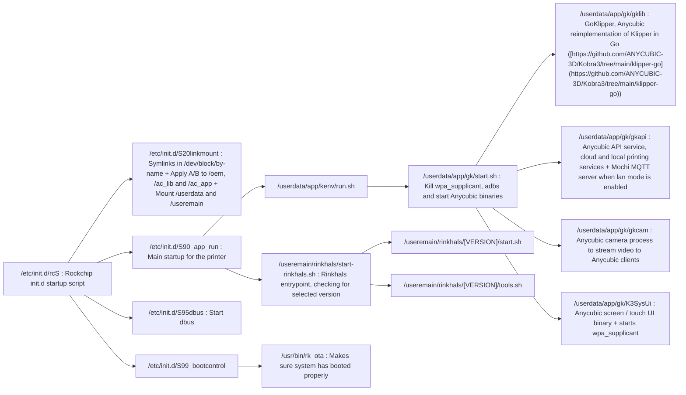
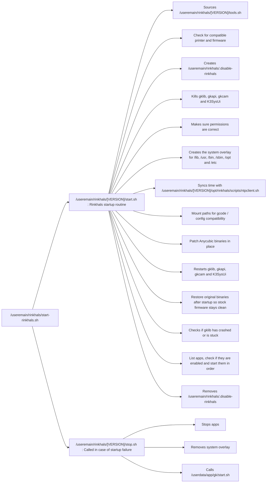

## Partitions

The system uses A/B partitions

- /dev/mmcblk0p1 : env
- /dev/mmcblk0p2 : idblock
- /dev/mmcblk0p3 : uboot_a
- /dev/mmcblk0p4 : uboot_b
- /dev/mmcblk0p5 : misc
- /dev/mmcblk0p6 : boot_a
- /dev/mmcblk0p7 : boot_b
- /dev/mmcblk0p8 : system_a
- /dev/mmcblk0p9 : system_b
- /dev/mmcblk0p10 : oem_a
- /dev/mmcblk0p11 : oem_b
- /dev/mmcblk0p12 : userdata
- /dev/mmcblk0p13 : ac_lib_a
- /dev/mmcblk0p14 : ac_lib_b
- /dev/mmcblk0p15 : ac_app_a
- /dev/mmcblk0p16 : ac_app_b
- /dev/mmcblk0p17 : useremain

## udev rules

In `/lib/udev/rules.d`:
- 61-udisk-auto-mount.rules : Rule to autostart /userdata/channel.sh on USB drive mount

## Kobra startup sequence

## Rinkhals startup sequence
